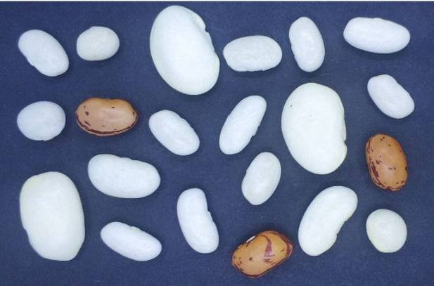

## Data Science Projects
### [Dry beans classification](Dry beans classification)

Seed classification is essential for both marketing and production to provide the principles of sustainable agricultural systems. 

The [dataset](https://archive.ics.uci.edu/ml/datasets/Dry+Bean+Dataset) is based on the following research paper; [Multiclass Classification of Dry Beans Using Computer Vision and Machine Learning Techniques](https://doi.org/10.1016/j.compag.2020.105507), 
where bean images obtained by a computer vision system were subjected to segmentation and feature extraction stages, giving a total of 16 features; 
12 dimensions and 4 shape forms, from 7 different classes of grains.

Through insight-driven feature engineering and models ensembling I was able to improve the overall accuracy 
presented in the research paper by 93% to 96% on the validation set, and 94% on the test set.

#### Project Highlights
1. EDA to extract insights and feature engineering
2. Soft voting ensemble classification model:
  1. CATBoost
  2. XGBoost
  3. Softmax Logistic Regression
  4- SVM - "Radial Gaussian Kernel"
  5- KNN

[Dry beans classification]: https://github.com/Omar-Safwat/DataScience_notebooks/tree/main/dry_beans_classification

