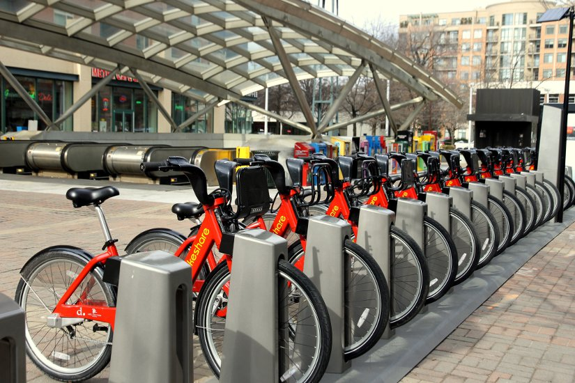

    <h2>Data Science Projects</h2>
        <h3 style="text-decoration: underline;">
            <a href="https://github.com/Omar-Safwat/DataScience_notebooks/tree/main/dry_beans_classification">Dry beans classification</a>
        </h3> 
        <h4><b>Description</b></h4>
        
        

        
Seed classification is essential for both marketing and production to provide the principles of sustainable agricultural systems. 

        

            The <a href="https://archive.ics.uci.edu/ml/datasets/Dry+Bean+Dataset">Dataset</a> is based on the following research paper; 
             <a href="https://doi.org/10.1016/j.compag.2020.105507">Multiclass Classification of Dry Beans Using Computer Vision and Machine Learning Techniques</a>,  
            where bean images obtained by a computer vision system were subjected to segmentation and feature extraction stages, giving a total of 16 features; 
            12 dimensions and 4 shape forms, from 7 different classes of grains.
        

        

            Through insight-driven feature engineering and models ensembling I was able to improve the overall accuracy 
            presented in the research paper by 93% to 96% on the validation set, and 94% on the test set.
        

        <h4><b>Project Highlights</b></h4>
        <ul>
            <li>EDA to extract insights and feature engineering</li>
            <li>Soft voting ensemble classification model:
                <ol>
                    <li>CATBoost</li>
                    <li>XGBoost</li>
                    <li>Softmax Logistic Regression</li>
                    <li>SVM - "Radial Gaussian Kernel"</li>
                    <li>KNN</li>
                </ol>
            </li>
        </ul>
    

        <h3 style="text-decoration: underline;">
            <a href="https://github.com/Omar-Safwat/DataScience_notebooks/tree/main/bike_rentals_competition">Seoul Bike Rentals</a>
        </h3>
        <h4><b>Description</b></h4>
        
        

            In this <a href="https://www.kaggle.com/c/seoul-bike-rental-ai-pro-iti">Kaggle competition</a>, the task was to build a regression model to predict the number of bikes rentals given time and weather data . 
            The training set held records for the first 20 days of each month, while the test set started from the 21th till the end of the month.
         

         <h4><b>Project Highlights</b></h4>
         <ul>
             <li>EDA and Data Preprocessing</li>
             <li>Regression model using XGBoost regressor</li>
             <li>Time series using sliding and rolling windows techniques</li>
         </ul>
    

        <h3 style="text-decoration: underline;"><a href="https://github.com/Omar-Safwat/DataScience_notebooks/tree/main/Car_crash_severity">Car Crash Severity Classification</a></h3>
        
        <h4><b>Description</b></h4>
        

            In this <a href="https://www.kaggle.com/c/car-crashes-severity-prediction/overview">Kaggle competition</a> the main objective was to predict the level of car crash severity, out of 4, 
            given the geographic location, weather and other relevant data. Competitors were also asked to clean and preprocess the data, 
            in order to output the highest accuracywithout tweaking the model given.
        

        <h4><b>Project Highlights</b></h4>
        <ul>
            <li>Time data preprocessing</li>
            <li>Feature engineeering and selection, using Chi-Square statistics</li>
        </ul>
    

