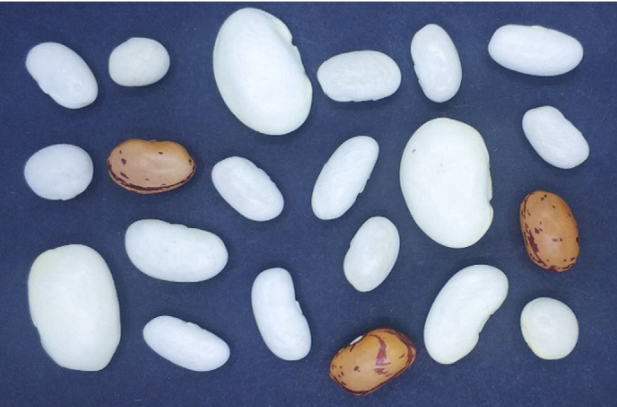

    <h2>Data Science Projects</h2>
    

        <h3>
            <a href="https://github.com/Omar-Safwat/DataScience_notebooks/tree/main/dry_beans_classification">Dry beans classification</a>
        </h3> 
        
        

            Seed classification is essential for both marketing and production to provide the principles of sustainable agricultural systems.  

            The <a href="https://archive.ics.uci.edu/ml/datasets/Dry+Bean+Dataset">Dataset</a> is based on the following research paper; [Multiclass Classification of Dry Beans Using Computer Vision and Machine Learning Techniques](https://doi.org/10.1016/j.compag.2020.105507), 
            where bean images obtained by a computer vision system were subjected to segmentation and feature extraction stages, giving a total of 16 features; 
            12 dimensions and 4 shape forms, from 7 different classes of grains. 

            Through insight-driven feature engineering and models ensembling I was able to improve the overall accuracy 
            presented in the research paper by 93% to 96% on the validation set, and 94% on the test set.
        

        <h4>Project Highlights</h4>
        
        1. EDA to extract insights and feature engineering
        2. Soft voting ensemble classification model:
        <ol>
            <li>CATBoost</li>
            <li>XGBoost</li>
            <li>Softmax Logistic Regression</li>
            <li>SVM - "Radial Gaussian Kernel"</li>
            <li>KNN</li>
        </ol>
    

